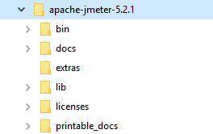
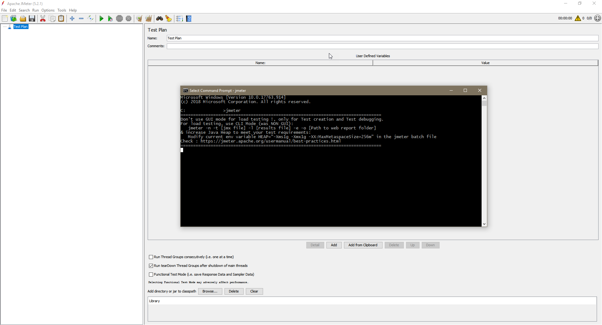
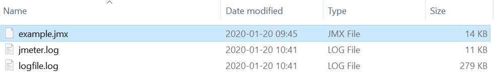

# hello-jmeter

This repository contains introduction to the JMeter and example JMeter test.

For general description visit: https://jmeter.apache.org/

# Installation
## Method 1
Requirements:
* Java JDK installed

Installation process:
1. Download JMeter: https://jmeter.apache.org/download_jmeter.cgi
2. Unzip downloaded JMeter in any directory you want. You just installed JMeter.

Description of installed content (folders).



* /bin: Contains JMeter script file for starting JMeter
* /docs: JMeter documentation files
* /extras: ant related extra files
* /lib/: Contains the required Java library for JMeter
* /lib/ext: contains the core jar files for JMeter and the protocols
* /lib/junit: Junit library used for JMeter


## Method 2
Note: This method is for the Windows system only.

JMeter can be install using chocolatey (package manager for Windows).
To install you just need to execute the command:
> choco install jmeter

This will install JMeter and setup environment variables that allow starting JMeter GUI just by type in command line jmeter.



# Lunch JMeter
JMeter can be started in 3 modes.
* GUI Mode
* Command Line Mode
* Server Mode

## Start JMeter in GUI Mode
***You should use CLI mode (NON GUI) to start your test.*** Use GUI to create and debug tests.

To start JMeter in Windows you just need to run file ***<jmeter_installation_folder>/bin/jmeter.bat***.


## Start JMeter in Command Line Mode
To start JMeter test in command line you can use following command:
jmeter -n -t *[jmx_test_file.jmx]* -l *[log_file.log]*

Example:
> jmeter -n -t .\example.jmx -l logfile.log

Result of above command:
```
Creating summariser <summary>
Created the tree successfully using .\example.jmx
Starting standalone test @ Mon Jan 20 10:40:28 CET 2020 (1579513228383)
Waiting for possible Shutdown/StopTestNow/HeapDump/ThreadDump message on port 4445
summary +      1 in 00:00:01 =    0.8/s Avg:   442 Min:   442 Max:   442 Err:     0 (0.00%) Active: 20 Started: 20 Finished: 0
summary +   1915 in 00:00:29 =   65.2/s Avg:   306 Min:   266 Max:  1274 Err:     0 (0.00%) Active: 20 Started: 20 Finished: 0
summary =   1916 in 00:00:31 =   62.5/s Avg:   306 Min:   266 Max:  1274 Err:     0 (0.00%)
summary +     84 in 00:00:09 =    9.0/s Avg:   627 Min:   267 Max:  9344 Err:     1 (1.19%) Active: 0 Started: 20 Finished: 20
summary =   2000 in 00:00:40 =   50.1/s Avg:   320 Min:   266 Max:  9344 Err:     1 (0.05%)
Tidying up ...    @ Mon Jan 20 10:41:09 CET 2020 (1579513269309)
... end of run
```



## Start JMeter in Server Mode
To start JMeter in Server Mode use ***<jmeter_installation_folder>/bin/jmeter-server.bat***

Also you can use command:
> jmeter -n -t .\example.jmx -l logfile.log -H 127.0.0.1 -P 8080

to distribute test(s) to other servers.

# Simple test plan - step by step (HTTP)
In this example I will use example api https://petstore.swagger.io/ 
1. JMeter started 
2. In `Test Plan` set name `Hello JMeter`
3. Click right mouse button on test plan and select `Add` -> `Threads (Users)` -> `Thread Group`
   1. Set `Name` to `Hello JMeter Thread Group`
   2. Set `Number of Threads (users)` to `10`
   3. Set `Loop Count` to `50`
   4. Uncheck `Same user on each iteration`
   5. Result 
4. Click right mouse button on thread group and select `Add` -> `Sampler` -> `HTTP Request`
   1. Set `Name` to `Petstore - Add a new pet to the store`
   2. Set `Protocol` to `http`
   3. Set `Server Name or IP` to `petstore.swagger.io`
   4. Set `Port Number` to `80`
   5. Set `Method` to `POST`
   6. Set `Path` to `/v2/pet`
   7. Uncheck `Follow Redirects` and `Use KeepAlive`
   8. Set `Body Data` to `{"id": 0,"category": {"id": 0,"name": "string"},"name": "doggie","photoUrls": ["string"],"tags": [{"id": 0,"name": "string"}],"status": "available"}`
   9. Result 
5. Click right mouse button on added `HTTP Request` and select `Add` -> `Config Element` -> `HTTP Cookie Manager`
6. Click right mouse button on added `HTTP Request` and select `Add` -> `Config Element` -> `HTTP Header Manager`
   1. Add headers:
      1. accept: application/json
      2. Content-Type: application/json
   2. Result 
7. Click right mouse button on added `HTTP Request` and select `Add` -> `Listener`:
   1. Add:
      1. `View Results Tree` and in field `Filename` set `~/report/viewResultsTree.xml`
      2. `Summary Report` and in `Filename` set `~/report/summaryReport.xml`
      3. `Graph Results` and in `Filename` set `~/report/graphResults.xml`
8. Project is ready to run

## Execute prepared test plan
***You should use CLI mode (NON GUI) to start your test.***

### For debug purposes test plan can be run from GUI.
Results:


### Command line execute
> jmeter -n -t .\hello-jmeter.jmx -l logfile.log

Result
```
Creating summariser <summary>
Created the tree successfully using .\hello-jmeter.jmx
Starting standalone test @ Thu Jan 23 15:06:08 CET 2020 (1579788368555)
Waiting for possible Shutdown/StopTestNow/HeapDump/ThreadDump message on port 4445
summary =    500 in 00:00:18 =   27.2/s Avg:   312 Min:   266 Max:  3271 Err:     0 (0.00%)
Tidying up ...    @ Thu Jan 23 15:06:27 CET 2020 (1579788387651)
... end of run
```


# Useful tutorials
* JMeter Tutorial For Beginners: https://www.youtube.com/watch?v=mXGcBvWYl-U
* JMeter Tutorials: The Complete Free Training On JMeter (20+ Videos): https://www.softwaretestinghelp.com/jmeter-tutorials/